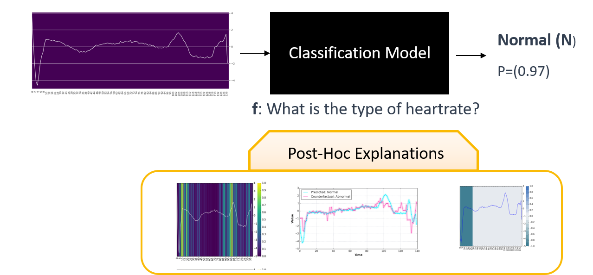

# Explainable and Interpretable Machine Learning

Explainable Artificial Intelligence (XAI) is an emerging field trying to make AI systems more understandable to humans. The goal of XAI, according to DARPA[@gunning2017explainable], is to “produce more explainable models, while maintaining a high level of learning performance (prediction accuracy); and enable human users to understand, appropriately, trust, and effectively manage the emerging generation of artificially intelligent partners”.  Especially on deep networks in high-stake scenarios understanding the decision process or the decision is crucial to prevent harm (e.g.,  autonomous  driving or anything health-related).

Multiple terms are strongly related to XAI. Most  famously "Explainability" and "Interpretability". Both terms are often used interchangeably with no consent on definitions existing the literature. 

"Interpretability" in the context of TSInterpret refers to the ability to support user understanding and comprehension of the model decision-making process and predictions. Used to provide user uunderstanding of model decisions, "Explainability" algorithms are used. Thereby, it is often the case that multiple explainability algorithms are necessary for the user to understand the decision process.

"Explainability" tries  to provide algorithms that give insights into model predictions: 

- How does a prediction change dependent on feature inputs?

- What features are or are not important for a given prediction?

- What features would you have to change minimally to obtain a new prediction of your choosing?

- How does each feature contribute to a model’s prediction?

Interpretability is the end goal. Explanations and explainability are tools to reach interpretability [@honegger2018shedding].

TSInterpret provides a set of algorithms or methods known as explainers specifically for time series. Each explainer provides a different kind of insight about a model (- i.e., answers different questions).  The set of algorithms available to a specific model depends on several factors. For instance, some approaches need a gradient to function and can only be applied to models providing such. A full listing can be found in the section Algorithm Overview. 

## Application
As machine learning methods have become increasingly complex, with many practitioners applying machine and, specifically, deep learning methods, the need to understand the decisions made by models is only increasing.

**Trust**: Explanations can build trust in the machine learning systems and increase social acceptance by providing insights into the basis of a decision.

**Debugging and Auditing**: An explanation for an erroneous prediction helps to understand the cause of the error (e.g., by showing the model focus) and delivers a direction for how to fix the system. Further, by computing feature attributions toward a model's prediction, users can check whether those attributions are consistent with their understanding.

**Research**: Explainability allows us to understand how and why models make decisions, thereby helping to understand the effects of the particular model or training schema.

## Taxonomy 
Explanations Methods and Techniques for Model Interpretability can be classified according to different criteria. In this section, we only introduce the criterias most relevant to TSInterpret.

### Post-Hoc vs Instrinct

Instrinct Interpretability refers to models that are interpretable by design. This can be achieved by constraining model complexity or including explanation components in the model design. 

Post-Hoc Interpretability refers to explanation methods applied after model training and are usually decoupled from the model. 

### Model-Specific vs Model-Agnostic

Model-Specific methods are limited to specific model classes and usually rely on a specific model internal (e.g., Gradients).

Model-Agnostic methods can be applied to any model and rely on analyzing the connection between inputs and output. Those methods cannot access the model's internal functions.

### Results of Explanation Methods

- **Feature Attribution methods (FA)** return a per-feature attribution score based on the feature’s contribution to the model’s output
- **Instance-based methods (IB)** calculate a subset of relevant features that must be present to retain or remove a change in the prediction of a given mode
- **Surrogate Models** train a simpler interpretable model.

## Simple Example 

Take, for example, a Decision Support System to classify heart rates as depicted in the figure below. While the data scientist knows that the machine learning model can obtain an accuracy of over 90 % to classify a heart rate as abnormal or normal, the decision process of such a system is still intransparent resulting in unsureness about the decision process of a model. Wrong Classifications in both directions can have long-lasting effects on a patient relying on the system. If a heart rate is wrongly classified as normal, a patient will not get the necessary medication. If a heart rate is wrongly classified as Abnormal, a patient would get medication and endure side effects although his heart might still be health 
To make this decision process more opaque, a data scientist might decide to use algorithms for explainable and interpretable machine learning, to learn: 
    - Which features are important.
    - Which feature influences the decision of a model positively or negatively.
    - How a counter-example would look like.

