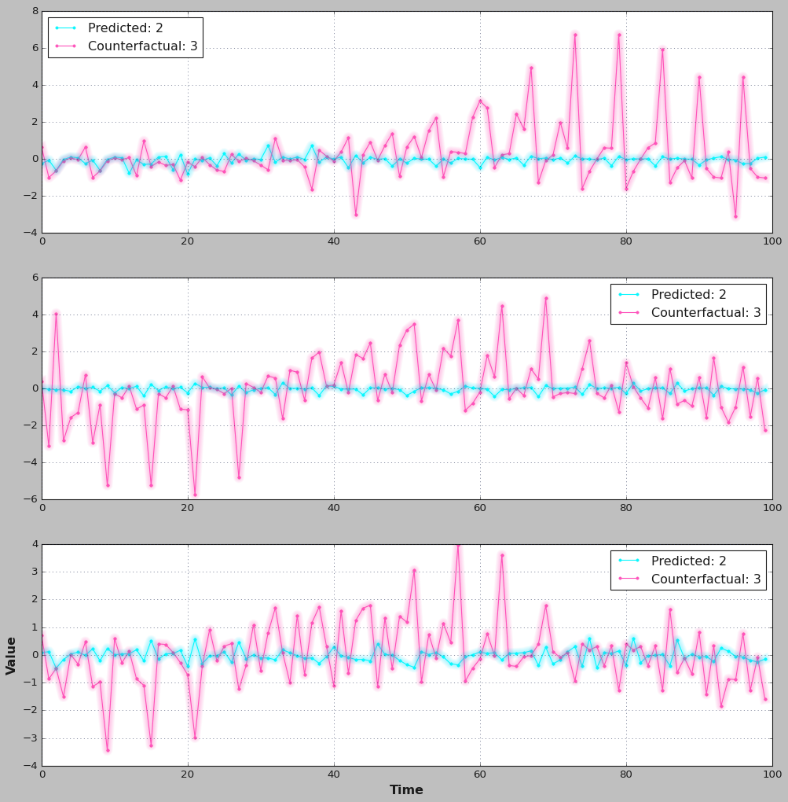
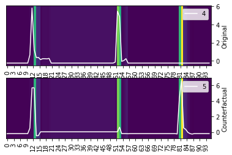
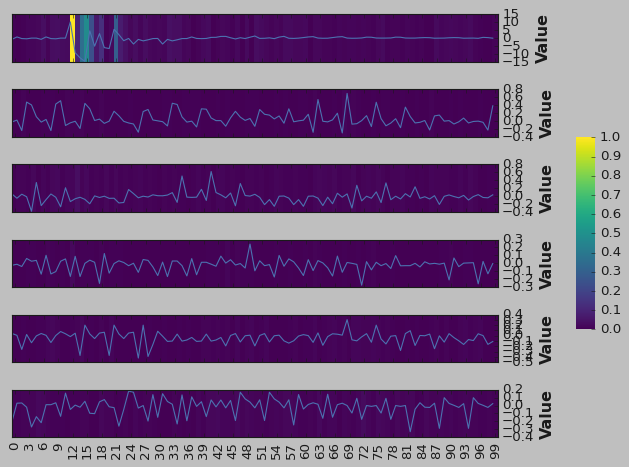
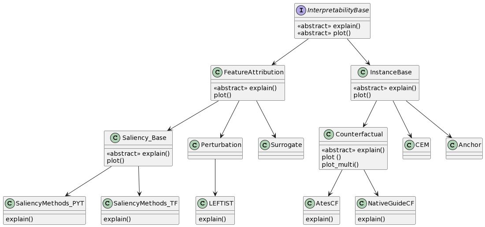

    

<h1 align="center"><b>Welcome to TSInterpret</b></h1>

    TSInterpret is a Python library for interpreting time series classification.
    The ambition is to facilitate the usage of time series interpretability methods. 
    Thereby TSInterpret implements various interpretability algorithms specifically for time series classification on various frameworks (PYT, tf, sklearn). 
    Furthermore, it provides unified visualizations of the results of the implemented algorithms. Wherever possible, TSInterpret is built on existing interpretability libraries like <a href="https://shap.readthedocs.io/en/latest/index.html">shap</a>, <a href="https://captum.ai/">captum</a> and <a href="https://github.com/sicara/tf-explain/">tf-explain</a>.  

 <table class="super-centered" border="0" cellpadding="0">
  <tr>
    <td class="left">Counterfactual Ates et al. [@ates_counterfactual_2021]</td>
     <td>   </td>
    <td  class="left">NUN-CF [@sanchez-ruiz_instance-based_2021]</td>
  </tr>
  <tr>
    <td class="left">  </td>
     <td >   </td>
    <td class="right"> </td>
  </tr>
  <tr>
    <td  class="left">LEFTIST [@guilleme_agnostic_2019]</td>
     <td>   </td>
    <td  class="left">TSR [@ismail_benchmarking_2020]</td>
  </tr>
   <tr>
    <td class="left">  </td>
     <td>   </td>
    <td class="right">  <td>
  </tr>
  <tr>
    <td  class="left">SETS [@bahri2022shapelet]</td>
     <td>   </td>
    <td  class="left">TSEvo [@hollig2022tsevo]</td>
  </tr>
   <tr>
    <td class="left">  </td>
     <td>   </td>
    <td class="right">  <td>
  </tr>
</table> 

<!--

  

-->

<h4 align="left"><b>Why a special package for the interpretability of time series predictors? </b></h4>

Compared to other data types like tabular, image, or natural language data, time series data is unintuitive to understand. Approaches to the explainability of tabular regression and classification often assume independent features.  Compared to images or textual data, humans cannot intuitively and instinctively understand the underlying information contained in time series data. Further, research has shown that applying explainability algorithms for tabular, image, or natural language data often yields non-understandable  and inaccurate explanations, as they do not consider the time component (e.g., highlighting many unconnected time-steps, instead of features or time slices[@ismail_benchmarking_2020]). 
Increasing research has focused on developing and adapting approaches to time series (survey[@rojat2021explainable]). However, with no unified interface, accessibility to those methods is still an issue. TSInterpret tries to facilitate this by providing a PyPI package with a unified interface for multiple algorithms, documentation, and learning resources (notebooks) on the application.

\bibliography
