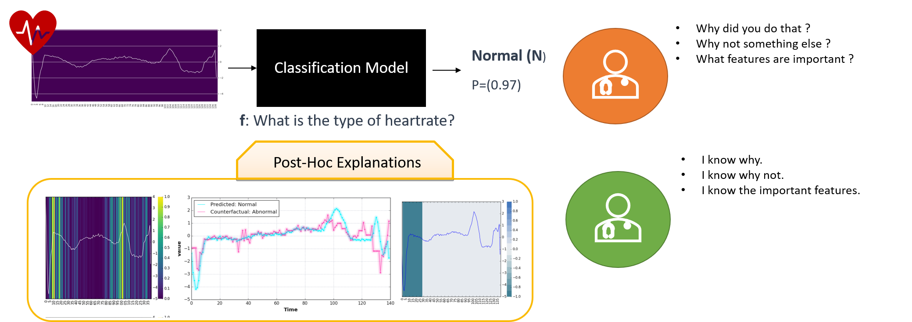

# Summary

`TSInterpret` is a python package that enables post-hoc interpretability and explanation of black-box time series classifiers with three lines of code. Due to the specific structure of time series (i.e., non-independent features [@ismail_benchmarking_2020], unintuitve visualizations [@siddiqui_tsviz_2019], traditional interpretability and explainability libraries [e.g., @kokhlikyan_captum_2020;@klaise_alibi_2021;@meudec_raphael_tf-explain_2021] ) find limited usage. `TSInterpret` specifically addresses the issue of black-box time series classification by providing a unified interface to state-of-the-art interpretation algorithms in combination with default plots. In addition, the package provides a framework for developing additional easy-to-use interpretability methods.

# Statement of need

Temporal data is ubiquitous and encountered in many real-world applications ranging from electronic health records [@rajkomar_scalable_2018] to cyber security [@susto_time-series_2018]. Although deep learning methods have been successful in the field of Computer Vision (CV) and Natural Language Processing (NLP) for almost a decade, application on time series has only occurred in the past few years (e.g.,[@fawaz_deep_2019;@rajkomar_scalable_2018;@susto_time-series_2018;@ruiz_great_2021]. Deep learning models have achieved state-of-the-art results on time series classification [e.g., @fawaz_deep_2019]. However, those methods are black boxes due to their complexity which limits their application to high-stake scenarios (e.g., in medicine or autonomous driving), where user trust and understandability of the decision process are crucial. In such a case, post-hoc interpretability is useful as it enables the analysis of already trained models without model modification. Much work has been done on post-hoc interpretability in CV and NLP, but most developed approaches are not directly applicable to time series data. The time component impedes the usage of existing methods  [@ismail_benchmarking_2020]. Thus, increasing effort is put into adapting existing methods to time series (e.g., LEFTIST based on SHAP / Lime [@guilleme_agnostic_2019], Temporal Saliency Rescaling for Saliency Methods [@ismail_benchmarking_2020], or Counterfactuals [@ates_counterfactual_2021;@sanchez-ruiz_instance-based_2021]). Compared to images or textual data, humans cannot intuitively and instinctively understand the underlying information in time series data. Therefore, time series data, both uni- and multivariate, have an unintuitive nature, lacking an understanding at first sight  [@siddiqui_tsviz_2019]. Hence, providing suitable visualizations of time series interpretability becomes crucial.

# Features

Explanations can take various form (see Figure \autoref{fig:Example}). Different use cases or users need different types of explanations. While for a domain expert, counterfactuals are useful, a data scientist or machine learning engineer prefers gradient-based approaches [@ ismail_benchmarking_2020] to evaluate the model's feature attribution.

{}

Counterfactual approaches calculate counterexamples by finding a time series close to the original time series that is classified differently, thereby showing decision boundaries. The intuition is to answer the question 'What if?'. `TSInterpret` implements @ates_counterfactual_2021, a perturbation-based approach for multivariate data, and @sanchez-ruiz_instance-based_2021 for univariate time series.
Gradient-based approaches (e.g., GradCam) were adapted to time series by @ismail_benchmarking_2020 who proposed rescaling according to time step importance and feature importance. This is applicable to both gradient and perturbation-based methods and based on tf-explain [@meudec_raphael_tf-explain_2021] and captum [@kokhlikyan_captum_2020]. 
LEFTIST by @guilleme_agnostic_2019 calculates feature importance based on a variety of Lime based on shapelets.

{ width=50% }

`TSInterpret` implements these algorithms according to the taxonomy shown in \autoref{fig:Architecture}. The interpretability methods are sorted according to a) the model output (e.g., is a feature map returned or an example time series) and b) the used mechanism (e.g., based on gradients). All implemented objects share a consistent interface to ensure that all methods contain an explain() and a plot() function. The plot function is implemented on the level below the interface based on the output structure provided by the interpretability algorithm to provide a unified visualization experience (e.g., in the case of Feature Attribution, the plot function visualizes a heatmap on the original sample). If necessary, those plots are refined by the Mechanism layer. The explain function is implemented on the method level. This high reusability ensures the consistency and extensibility of the framework.

# Acknowledgements

This work was carried out with the support of the German Federal Ministry of Education
and Research (BMBF) within the project ”MetaLearn” (Grant 02P20A013).

# References
